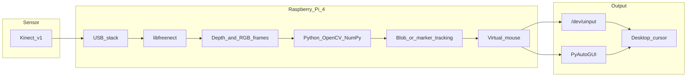

# KinectNext / KenectMouse — Project overview

## Abstract

This project explores **camera-based, touchless input** on a **Raspberry Pi 4** using the **Kinect for Xbox 360 (Kinect v1)**—a depth-capable sensor originally bundled with the Xbox 360. The goal is to offer an alternative to a physical mouse for desktop control and, in future work, to drive **small interactive games** from the same input pipeline. By running **Linux** and the open-source **libfreenect** stack, the system captures **depth** (and optionally **RGB**) frames and maps hand or marker motion to **cursor movement** and clicks.

The software combines **Python**, **NumPy**, **OpenCV**, and **freenect** bindings to segment the nearest object or a colored marker in the scene, then emits **virtual mouse** events either through the **`/dev/uinput`** interface (well suited to headless or Docker setups on the Pi) or through **PyAutoGUI** on a graphical desktop. Parameters such as depth bands, blob area limits, and screen edge margins are tunable so the tracker can be adapted to different rooms, lighting, and user posture.

The Kinect v1 is **not** the newer **Azure Kinect**; it uses a **structured-light** depth approach at typical **640×480** resolution at interactive frame rates. On Raspberry Pi OS, installation and runtime details—including USB stability, kernel modules, and Python dependencies—are documented separately for reproducibility.

**Roadmap:** the current focus is reliable **mouse emulation** and preview tooling. **Lightweight games** (e.g., cursor-driven or gesture-triggered minigames) are planned as a natural extension once the control loop is stable in your target environment.

---

## Features

### Implemented

- **Depth-based cursor control** — Nearest-object or depth-band blob tracking; maps Kinect coordinates to screen space with calibration options (margins, axis flip, sensitivity).
- **Wave / arming gesture** — Motion pattern used to arm tracking before cursor control (see project README).
- **Virtual mouse output** — Linux **`/dev/uinput`** device (`kinect_v1_mouse.py`) for broad compatibility, including Docker on the Pi.
- **Desktop path** — **`kinect_mouse.py`** with **PyAutoGUI** for X11/desktop sessions; optional **click** via depth “push” detection.
- **RGB marker mode** — Optional **HSV** color tracking (e.g., bright marker) with optional **depth refinement** to reduce ambiguity.
- **Preview and capture** — Scripts for live depth/RGB preview and **PNG snapshots** without a full GUI stack where applicable.
- **Container workflow** — **Dockerfile** and **docker-compose** for repeatable deployment.
- **Developer workflow on Windows** — **WSL2** notes and **usbipd** scripts to attach the Kinect USB devices for development/testing.

### Planned

- **Small games** — Reuse the same depth/RGB pipeline for interactive experiences (timing, scoring, simple physics) once input latency and robustness meet your bar.

---

## Capabilities from the Xbox Kinect (v1) camera

The **Kinect for Xbox 360** is a **depth camera** with an **RGB** video stream and a **motor** for tilt. Understanding **hardware capabilities** versus **what this project uses on Linux** avoids confusion with marketing or with the newer **Azure Kinect** or **Kinect for Windows SDK** runtimes.

### Hardware-level capabilities

| Capability | Notes |
|------------|--------|
| **Depth map** | Typically **640×480** at about **30 fps**; each pixel encodes distance (raw values mapped to millimeters in software). Based on **infrared structured light** (pattern projection + IR imaging). |
| **RGB video** | Color frames at similar resolution; useful for **markers**, **debug overlays**, or future vision features. |
| **IR stack** | **IR projector** + **IR camera** work together to compute depth; not the same as a simple 2D webcam. |
| **Motor** | **Tilt** adjustment for mounting; drivers may expose tilt via **libfreenect**. |
| **Audio** | Kinect includes a **microphone array** on some models; this mouse project does not depend on it. |

### What this project uses on Linux (libfreenect + Python)

| Topic | Reality on this stack |
|-------|------------------------|
| **Depth + RGB** | **libfreenect** exposes depth and video streams; the project processes them in **Python/OpenCV/NumPy**. |
| **Blob / marker tracking** | **Custom** segmentation (nearest depth blob or **HSV** color blob), not Microsoft’s proprietary body tracker. |
| **Skeleton / body tracking** | The **Kinect for Windows SDK** on Windows provided full **skeleton tracking**; that runtime is **not** used here. Comparable body tracking on Linux would require a different library or pipeline (e.g., ML pose estimation on RGB or depth)—**out of scope** for the current scripts. |
| **Performance on Pi** | Depth + OpenCV processing is feasible on a **Pi 4** with realistic resolution and tuning; USB bandwidth and power matter for stability. |

---

## Research and sources

References are grouped for **hardware**, **open-source drivers**, and **human–computer interaction**. URLs are included for follow-up reading.

### Hardware and sensing

1. **Wikipedia — Kinect** — High-level history and generations of Kinect devices (v1 vs later products).  
   https://en.wikipedia.org/wiki/Kinect

2. **Khoshelham, R., & Elberink, S. O. (2012).** Accuracy and resolution of Kinect depth data for indoor mapping applications. *Sensors*, 12(2), 1437–1454. — Peer-reviewed analysis of Kinect depth accuracy (useful context for depth maps).  
   https://doi.org/10.3390/s120201437

### OpenKinect, libfreenect, and community

3. **OpenKinect / libfreenect** — Project home and documentation for the open driver stack used on Linux.  
   https://openkinect.org/wiki/Main_Page

4. **libfreenect (GitHub)** — Source repository, build notes, and issue discussions.  
   https://github.com/OpenKinect/libfreenect

### Kinect-era body tracking (context only; not used on Linux here)

5. **Shotton, J., et al. (2013).** Real-time human pose recognition in parts from single depth images. *Communications of the ACM*, 56(1), 116–124. — Foundational work behind Kinect’s depth-body pipeline on **Microsoft’s** stack; illustrates what the **hardware** can enable with a large proprietary model, distinct from this repo’s **blob-tracking** approach.  
   https://doi.org/10.1145/2398356.2398381  
   https://cacm.acm.org/research/real-time-human-pose-recognition-in-parts-from-single-depth-images/

### Natural user interfaces and depth interaction

6. **Saffer, D. (2009).** *Designing Gestural Interfaces* — O’Reilly — Design patterns for touchless and gestural UIs (principles applicable to depth-driven control).  
   https://www.oreilly.com/library/view/designing-gestural-interfaces/9780596158164/

---

## System architecture diagram

End-to-end data flow from sensor to desktop cursor (conceptual).

**Legend:** On a given run you typically use either **`uinput`** (e.g., `kinect_v1_mouse.py`, Docker) or **PyAutoGUI** (e.g., `kinect_mouse.py` on a desktop), not necessarily both at once.

---

## Figures (placeholders)

Add your own photos or screenshots under [`docs/images/`](docs/images/) and replace the filenames below. Until then, these entries describe suggested shots.

| Suggested file | Description |
|----------------|-------------|
| `docs/images/hardware_setup.jpg` | Wide shot: Raspberry Pi 4, Kinect v1, USB/power cabling, and monitor. |
| `docs/images/depth_preview.png` | Screenshot or photo of depth preview (what the tracker sees), from `scripts/kinect_preview.py` or similar. |
| `docs/images/rgb_marker.png` | RGB view showing a colored marker or hand region used for `--use-rgb` mode. |
| `docs/images/desktop_in_use.jpg` | User operating the desktop via Kinect-controlled cursor (privacy permitting). |
| `docs/images/docker_or_terminal.png` | Optional: terminal showing `docker compose` or native run on the Pi. |

**Note:** Git does not include binary images until you add them; the [`docs/images/`](docs/images/) folder holds a `.gitkeep` so the path exists in the repository.

---

## Reproducibility

For step-by-step installation on Raspberry Pi (packages, venv, `libfreenect`, and run commands), see **[`RUN_ON_PI.md`](RUN_ON_PI.md)**. For quick start and Docker/WSL notes, see **[`README.md`](README.md)**.
